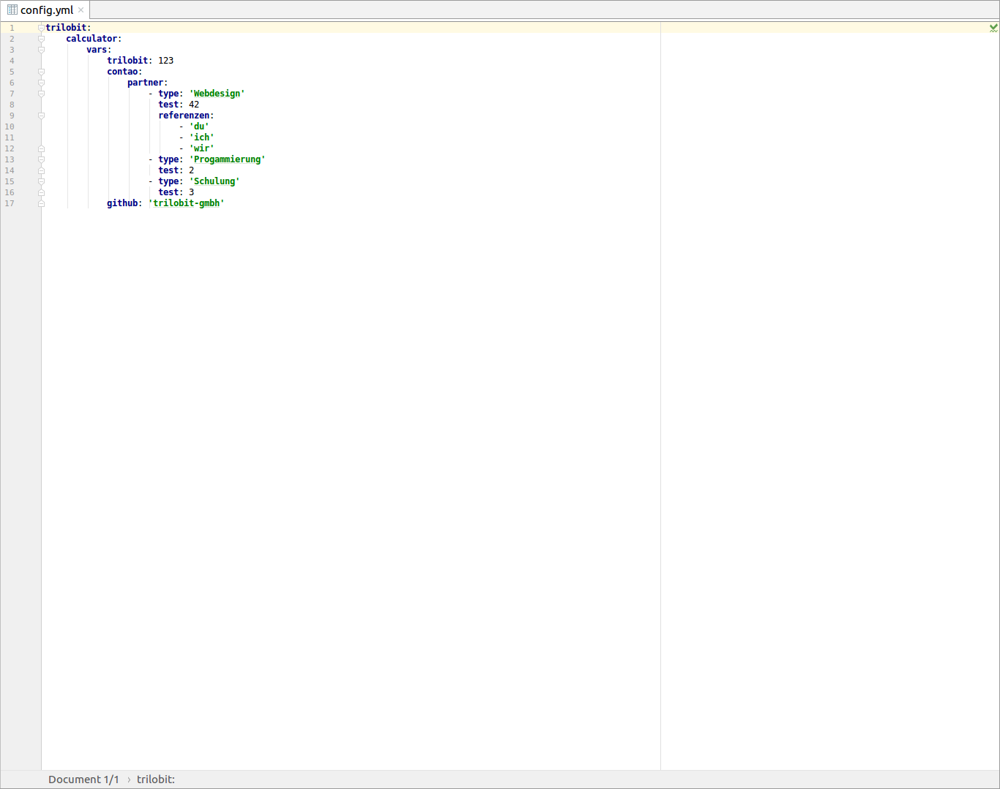
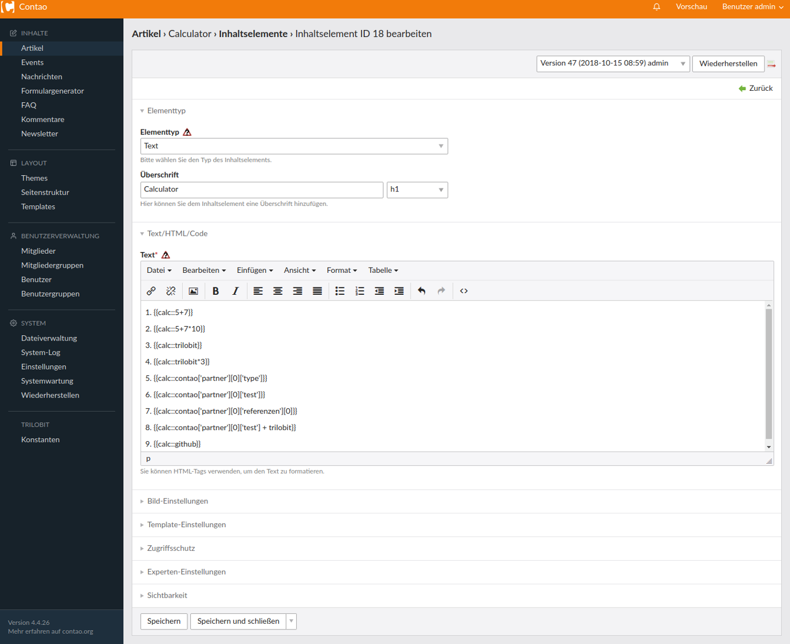

Calculator Bundle
=================

Das Calculator Bundle ermöglicht es durch Verwendung eines Insert-Tags eine Vielzahl an Operationen durchzuführen.
Mögliche Operationen währen arithmetische Operationen, mit denen es möglich ist, einfache bis verschachtelte Berechnungen
auszuführen. Durch die Verwendung der Symfony Expression Language ist es außerdem möglich, Variablen zu definieren 
und diese wiederum für Operationen zu verwenden. Diese Variablen werden in der config.yml definiert und müssen wie
ein Array aufgebaut sein.

Aufbau
------

Der Insert-Tag wird durch die Abkürzung "calc" definiert und mit zwei Doppelpunkten von der Operation getrennt. 
Dies könnte zum Beispiel so aussehen: {{calc::5 + 7}}, 
mit Variablen so: {{calc::Länge * Breite}}
oder so {{calc::Rechteck['Länge'] * Rechteck['Breite']}}.

Calculator bundle
=================

The Calculator Bundle allows you to perform a variety of operations by using an insert-tag. Possible operations 
could be arithmetical operations with which it is possible to do simple to complex calculations. By using the 
Symfony Expression Language it is also possible to define variables and to use these again for operations. 
These variables are defined in the config.yml and have to be constructed like an array.

Structure
---------

The insert tag is defined by the abbreviation "calc" and separated from the operation with two colons.
For example, this could look like this: {{calc::5 + 7}},
with variables like this: {{calc::length * width}}
or like this {{calc::rectangle['length'] * rectangle['width']}}.

Screenshot
----------

config.yml zum definieren der Variablen

Syntax des Insert-Tags im Artikel

Ausgabe im Frontend

Installation
------------

Install the extension via composer: [trilobit-gmbh/contao-calculator-bundle](https://packagist.org/packages/trilobit-gmbh/contao-calculator-bundle).

Compatibility
-------------

- Contao version ~4.4
